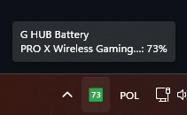

# GHubBattery

A lightweight Windows system tray app that shows your Logitech wireless headset battery percentage as a live colored icon — no hovering required.



## Features

- **Live battery % in the tray icon** — large bold number, color-coded green / amber / red
- **Multiple devices** — tracks all G HUB wireless devices, icon shows the lowest battery
- **Low battery notifications** — Windows balloon at configurable thresholds
- **Polling fallback** — re-fetches battery every 60 seconds so the number recovers after sleep/wake
- **Battery history log** — every reading appended to a JSON-lines file in `%LOCALAPPDATA%\GHubBatteryTray\`
- **Settings dialog** — configure thresholds, poll interval, notification toggle
- **Run at Windows startup** — one toggle in the right-click menu, no admin rights needed
- **Update checker** — compares against GitHub releases on launch
- **Crash log** — unhandled exceptions written to `%LOCALAPPDATA%\GHubBatteryTray\crash.log`
- **Single `.exe`** — no installer, no dependencies, no .NET runtime required on the target machine

## Requirements

- Windows 10 / 11
- [Logitech G HUB](https://www.logitechg.com/innovation/g-hub.html) installed and running
- A Logitech wireless device with battery reporting (e.g. PRO X Wireless headset)

To **build from source**: [.NET 8 SDK](https://dotnet.microsoft.com/download/dotnet/8) is also required.

## Installation

1. Download `GHubBattery.exe` from the [latest release](../../releases/latest)
2. Place it somewhere permanent (e.g. `C:\Program Files\GHubBattery\`)
3. Double-click to run — the tray icon appears immediately
4. Right-click the icon → **Run at Windows startup** to auto-launch on login

## Building from source

```powershell
git clone https://github.com/pyrka-98/GHubBattery.git
cd GHubBattery
.\publish.ps1
# Output: publish\GHubBattery.exe
```

The publish script produces a self-contained single-file executable (~72 MB, includes the .NET 8 runtime).

For development / quick iteration:

```powershell
cd src
dotnet run
```

## Update checker setup

Open `src\UpdateChecker.cs` and set your GitHub username and repo name:

```csharp
private const string Owner = "pyrka-98";
private const string Repo  = "GHubBattery";
```

The app checks for new releases 10 seconds after launch and shows a tray balloon if a newer version is available.

## Tray icon colors

| Color | Meaning |
|-------|---------|
| Green | Battery ≥ 50% |
| Amber | Battery 20–49% |
| Red   | Battery < 20% |
| Gray  | G HUB offline or connecting |

A small yellow dot in the corner of the icon indicates the device is charging.

## Right-click menu

| Item | Action |
|------|--------|
| Device rows | Shows name, %, charging state (display only) |
| Refresh now | Force-fetches latest battery from G HUB |
| Open battery history log | Opens the `.jsonl` log file in your default text editor |
| Settings... | Opens the settings dialog |
| Run at Windows startup | Toggles the Windows registry run key |
| Exit | Quits the app and removes the tray icon |

## Settings

Accessible via right-click → **Settings...**

| Setting | Default | Description |
|---------|---------|-------------|
| Low battery warning | 20% | % that triggers a balloon notification |
| Critical battery level | 10% | % shown as an error-level balloon |
| Poll interval | 60s | How often to force-refresh via GET request |
| Show all devices | On | Show all devices in menu vs. only the worst |
| Enable notifications | On | Toggle low-battery balloon notifications |

Settings are stored in the Windows registry under `HKCU\Software\GHubBatteryTray\Settings`.

## Battery history log

Every battery reading is appended to:

```
%LOCALAPPDATA%\GHubBatteryTray\battery_history.jsonl
```

Each line is a JSON object:

```json
{"ts":"2026-03-23T09:12:01Z","device":"PRO X Wireless Gaming Headset","pct":72,"charging":false}
```

The file is capped at 10,000 entries (oldest pruned on startup). Open it via right-click → **Open battery history log**, or point any JSON-lines viewer at it.

## File map

| File | Purpose |
|------|---------|
| `Models.cs` | `DeviceBattery` record, `BatteryLevel` enum |
| `BatteryParser.cs` | Parses G HUB WebSocket JSON into `DeviceBattery` objects |
| `GHubConnector.cs` | WebSocket lifecycle, subscriptions, polling fallback, auto-reconnect |
| `BatteryStateStore.cs` | Thread-safe multi-device state dictionary |
| `TrayIconRenderer.cs` | GDI+ icon generator — colored rectangle with bold % number |
| `TrayManager.cs` | `NotifyIcon`, context menu, balloon alerts, multi-device display |
| `AppSettings.cs` | User settings, persisted to registry |
| `SettingsWindow.cs` | WinForms settings dialog |
| `BatteryHistory.cs` | JSON-lines battery log writer |
| `CrashLogger.cs` | Unhandled exception file logger |
| `UpdateChecker.cs` | GitHub releases update checker |
| `StartupManager.cs` | Windows registry run-at-login toggle |
| `Program.cs` | Entry point — wires all services, runs WinForms message pump |
| `app.manifest` | Per-monitor DPI awareness declaration |
| `publish.ps1` | One-command publish script → single `.exe` |

## How it works

G HUB exposes a local WebSocket server on `ws://localhost:9010`. The app:

1. Connects and subscribes to `/battery/state/changed` and `/devices/state/changed`
2. Sends `GET /devices/list` on connect to seed device names immediately
3. Receives pushed battery updates in real time
4. Falls back to polling `GET /devices/list` every 60 seconds to recover from missed pushes
5. Re-renders the tray icon on every change using GDI+
6. Auto-reconnects with exponential back-off if G HUB restarts

## Troubleshooting

**Icon stays gray / "G HUB offline"**
- Make sure Logitech G HUB is running
- G HUB must be fully loaded (not just starting up)

**Battery percentage not updating**
- Wait up to 60 seconds for the polling fallback to kick in
- Try right-click → Refresh now
- Turn your device off & on

**No devices shown**
- Your device may use different field names in G HUB's API. Check `%LOCALAPPDATA%\GHubBatteryTray\crash.log` for errors
- The G HUB API is undocumented and field names vary across versions

**App crashes silently**
- Check `%LOCALAPPDATA%\GHubBatteryTray\crash.log`

## License

MIT
